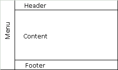

<h1 align="center">Desafio de projeto html </h1>

    Projeto: Criar Um Site de uma clinica médica, utilizando as Tags da linguagem HTML. 
    - Inserir tabela; 
    - Inserir Formulário; 
    - Inserir Mídia; 
    -Formatar os textos do site;

<h1 align="center">
    Estrutura das Páginas
</h1>

  

  <a href="#-tecnologias">Tecnologia</a>&nbsp;&nbsp;&nbsp;|&nbsp;&nbsp;&nbsp;
  <a href="#-projeto">Projeto</a>&nbsp;&nbsp;&nbsp;|&nbsp;&nbsp;&nbsp;

  

 

  

## 🚀 Tecnologias

Esse projeto foi desenvolvido com as seguintes tecnologias:

- HTML
- Git e Github

## 💻 Projeto

Desafio de Projeto DIO: Criar Um site de uma clinica médica, Utilizando as Tags Aprendidas Da linguagem HTML.

---

Feito com ♥ by Antonio Pereira